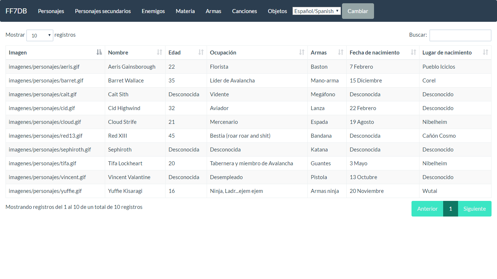

# FF7DBWEBV2

## Screenshots

### Goals

+ Rebuild the old site (http://pabloverdugo.es/ff7db)
     - ~~Basic template of all the data~~
     - ~~Build a simple user interface to query data~~
        - ~~'Bootstraped' the web~~
        - ~~Simple interface~~
     - Do beautiful but simple things.
+ Make the data accesible as Web Service
    - ~~Basic, get all data~~
    - Query Data (Filters)
+ Let's use a 'Cloud' web service (Self made) for all the data
     - Build the DB
     - Build the API
+ ~~Multi-language support (Web)~~
    - ~~Spanish~~
    - ~~English~~
+ Multi-language support (Data)
    - ~~Spanish~~
    - English
